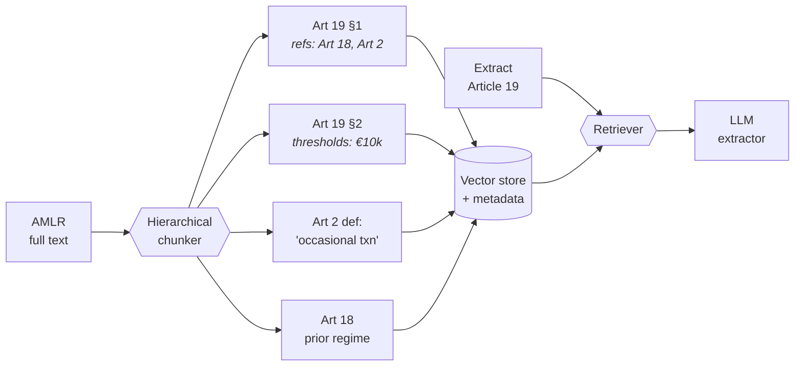
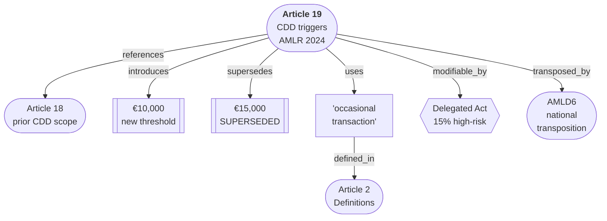
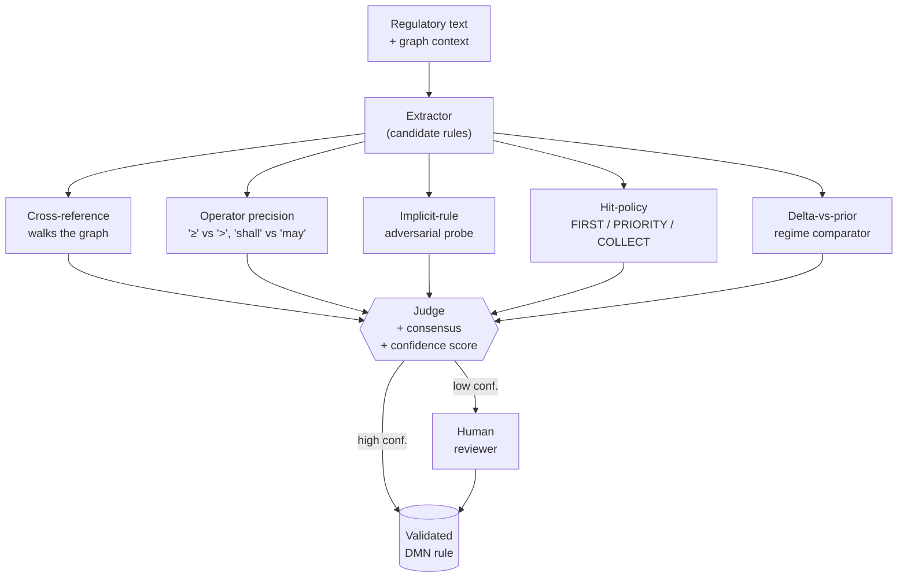
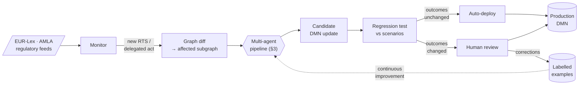

# README — Scaling the Extraction Pipeline Implementation Plan

> **For agentic workers:** REQUIRED SUB-SKILL: Use superpowers:subagent-driven-development (recommended) or superpowers:executing-plans to implement this plan task-by-task. Steps use checkbox (`- [ ]`) syntax for tracking.

**Goal:** Tidy the repo for tomorrow's interview by reverting an unstaged Modeler re-save, tightening the README opener and "Why" paragraphs, and adding a new "Scaling the Extraction Pipeline" section that maps four LLM techniques onto the five PoC error categories.

**Architecture:** Documentation-only change. Two commits: (1) revert the BPMN re-save, (2) the README tidy + new section as a single coherent doc update. Mermaid diagrams from `~/Downloads/regulation-llm-concepts.html` are copied verbatim into fenced blocks, with the cream-paper-themed `classDef` directives stripped so GitHub's mermaid renderer picks sensible default colors.

**Tech Stack:** Markdown (GitHub-flavored), Mermaid (GitHub native renderer), Git.

**Spec reference:** `docs/superpowers/specs/2026-05-13-readme-scaling-extraction-pipeline-design.md`

---

## File map

| File | Action | What it holds after the change |
|---|---|---|
| `diagrams/kyc-bo-rescreening.bpmn` | Revert (discard unstaged change) | Same as HEAD — the v5.20 commented version |
| `README.md` | Modify lines 3 (blurb), 11–13 (Why paras 2–3), insert new section after line 270 | Tighter opener; one-paragraph "Why" with a forward pointer; new `## Scaling the Extraction Pipeline` section before `## Extending This Project` |
| `docs/superpowers/plans/2026-05-13-readme-scaling-extraction-pipeline.md` | Create | This plan |

No other files are touched.

---

### Task 1: Revert the unstaged BPMN re-save

**Files:**
- Modify: `diagrams/kyc-bo-rescreening.bpmn` (revert to HEAD)

- [ ] **Step 1: View the full diff once more to confirm it is purely cosmetic**

Run:
```bash
git diff diagrams/kyc-bo-rescreening.bpmn | less
```

Expected: every removed line is either an XML comment (`<!-- ... -->`), a blank line, or a multi-line `<bpmn:definitions ...>` opening that was collapsed onto one line. No `<bpmn:` element body has changed. Every `<bpmn:documentation>` tag still appears in the file. The `exporterVersion` attribute changes from `5.20.0` to `5.44.0` — expected.

If you see edits to any task `<bpmn:documentation>` body, gateway condition, sequence flow source/target, or DI (`<bpmndi:...>`) coordinates, STOP and re-plan — the change is not cosmetic.

- [ ] **Step 2: Restore the file to HEAD**

Run:
```bash
git checkout -- diagrams/kyc-bo-rescreening.bpmn
```

- [ ] **Step 3: Verify the working tree is clean for diagrams/**

Run:
```bash
git status diagrams/
```

Expected:
```
nothing to commit, working tree clean
```
(or no `diagrams/` entries in the modified list)

- [ ] **Step 4: Verify the restored file matches the last commit's version**

Run:
```bash
git diff HEAD -- diagrams/kyc-bo-rescreening.bpmn
```

Expected: no output.

- [ ] **Step 5: (No commit needed — revert is just a working-tree restore, nothing was committed)**

There is nothing to commit for Task 1 — the file is back to its committed state.

---

### Task 2: Tighten the README opener (line 3)

**Files:**
- Modify: `README.md:3`

- [ ] **Step 1: Replace the one-sentence blurb with two shorter sentences**

Open `README.md` and replace this exact line 3:

```markdown
> A Camunda BPMN + DMN showcase modelling how a CIB bank would operationalise the EU's 2024 Anti-Money Laundering regulatory overhaul into executable decision logic and process automation — including an LLM-to-DMN extraction proof of concept demonstrating how regulatory text can be semi-automatically decomposed into validated decision tables.
```

With this:

```markdown
> A Camunda BPMN + DMN showcase modelling how a CIB bank operationalises the EU's 2024 Anti-Money Laundering overhaul (AMLR / AMLD6) into executable decision logic. Includes an LLM-to-DMN extraction proof of concept — and an architectural sketch of how that pipeline scales across a regulation portfolio.
```

(Both lines retain the leading `> ` blockquote marker.)

- [ ] **Step 2: Verify the change**

Run:
```bash
sed -n '3p' README.md
```

Expected: the new line, beginning `> A Camunda BPMN + DMN showcase modelling how a CIB bank operationalises ...` and ending `... how that pipeline scales across a regulation portfolio.`

- [ ] **Step 3: Do NOT commit yet** — bundled into Task 5's single commit.

---

### Task 3: Tighten the "Why This Project Exists" section

**Files:**
- Modify: `README.md:11-13` (the two paragraphs after the leading "On 31 May 2024..." paragraph)

- [ ] **Step 1: Replace paragraphs 2 and 3 with one tighter paragraph**

In `README.md`, the section currently reads (lines 9–13):

```markdown
On 31 May 2024, the EU adopted a comprehensive overhaul of its AML/CFT framework — replacing the directive-based approach with a directly applicable regulation for the first time. For Commercial & Investment Banking, this means every existing client relationship must be re-evaluated against updated beneficial ownership rules, new CDD thresholds, and harmonised EDD triggers before the **10 July 2027** application date.

This project models that re-screening process end-to-end: from regulatory change trigger through to updated KYC records and ongoing monitoring schedules. It demonstrates how regulatory language can be decomposed into **structured, auditable, executable decision logic** using DMN, orchestrated by a BPMN process.

The project also includes an **LLM-to-DMN extraction proof of concept** — showing how an LLM agent can pre-extract decision rules from regulatory text, with a DMN Modeller validating and correcting the output. This reflects the emerging workflow where LLM-assisted extraction scales regulatory encoding across large policy landscapes, with human expertise as the quality gate.
```

Leave the first paragraph (`On 31 May 2024 ...`) **unchanged**. Replace ONLY the second and third paragraphs (the two paragraphs starting with `This project models ...` and `The project also includes ...`) with this single paragraph:

```markdown
The project models that re-screening process end-to-end: from regulatory change trigger to updated KYC records and ongoing monitoring schedule, with three linked DMN tables encoding the rules and a BPMN process orchestrating the work. It also includes an LLM-to-DMN extraction proof of concept showing how regulatory text can be semi-automatically decomposed into validated decision tables — with the DMN Modeller as the quality gate, not the bottleneck. The four-layer architecture below extends that PoC into a pipeline that can keep up with a regulation portfolio as it evolves.
```

The blank line between the first paragraph and this new paragraph remains.

- [ ] **Step 2: Verify the change**

Run:
```bash
grep -n "The project models that re-screening" README.md
grep -n "four-layer architecture below" README.md
grep -c "This project models that re-screening" README.md
```

Expected:
- First grep: one match (a single line number in the 10–13 range).
- Second grep: one match (same line as the new paragraph, since it's all one line).
- Third grep: `0` (the old phrasing "This project models" should be gone).

- [ ] **Step 3: Do NOT commit yet** — bundled into Task 5's single commit.

---

### Task 4: Add the new "Scaling the Extraction Pipeline" section

**Files:**
- Modify: `README.md` — insert a new section between the existing `### Why This Matters` subsection (which ends around line 270) and the `---` separator that precedes `## Extending This Project` (around line 272).

The new section is large; this task has six steps, one per content block, with one verification step at the end.

- [ ] **Step 1: Locate the insertion point**

Run:
```bash
grep -n "^## Extending This Project" README.md
```

Note the line number — call it `N`. Currently the README at lines `N-2`, `N-1`, `N` reads:

```
---

## Extending This Project
```

The new section is inserted **between the existing `---` and the `## Extending This Project` heading**. After the edit, those lines should read:

```
---

## Scaling the Extraction Pipeline

[opening paragraph]

### 01 · Retrieval — Hierarchical RAG
[subsection content]

### 02 · Structure — Graph RAG
[subsection content]

### 03 · Specialisation — Multi-Agent Review
[subsection content]

### 04 · Evolution — The Self-Sustaining Loop
[subsection content]

> [closing blockquote]

---

## Extending This Project
```

The existing `---` (above `## Extending`) now separates `## Scaling the Extraction Pipeline` from the section above it (`## LLM-to-DMN Extraction`'s closing subsection). A **new** `---` is added after the closing blockquote to separate `## Scaling` from `## Extending`. Each `---` is surrounded by one blank line, matching the README's existing pattern.

- [ ] **Step 2: Insert the new section's heading, opening paragraph, and first subsection (01 Hierarchical RAG)**

Insert the following block immediately above the `---` separator that precedes `## Extending This Project`:

````markdown
## Scaling the Extraction Pipeline

The PoC made five error categories visible: context loss, missing implicit rules, operator imprecision, hit-policy choice, and missing deltas from the prior regime. Each of the four techniques below closes one of those categories. Stacked, they turn one-shot extraction into a pipeline that scales across a regulation portfolio and improves with use.

### 01 · Retrieval — Hierarchical RAG

*Preserves the document's spine.*

Fixed-size chunking shreds a regulation's structure. Instead, chunk along the natural hierarchy — Article → Paragraph → Subparagraph — and tag every chunk with metadata. At query time, retrieve the target plus its definitions and the articles it cites. This is what would have stopped the Article 19 walkthrough from missing Article 2's definition of "occasional transaction" and Article 18's prior-regime context.



| Fixes | Doesn't fix |
|---|---|
| Context-loss errors — extraction missing cited definitions or referenced articles. | Implicit rules, operator precision, hit-policy choice — these aren't a retrieval problem. |
````

- [ ] **Step 3: Append the second subsection (02 Graph RAG)**

Append directly after the table from Step 2:

````markdown

### 02 · Structure — Graph RAG

*Regulation is a typed graph, not a pile of text.*

Articles define terms, modify thresholds, supersede prior rules, and cross-reference each other. Model that explicitly. Now the LLM doesn't just see Article 19 — it sees the *relationships* Article 19 has to everything around it. This is what catches the "missing delta from prior regime" and "implicit rule" errors from the PoC.



| Fixes | Implementation |
|---|---|
| Implicit rules surface via traversal. Comparing Art 19 ↔ Art 18 reveals what changed. | Neo4j or any property graph; node embeddings give you semantic + structural search. |
````

- [ ] **Step 4: Append the third subsection (03 Multi-Agent Review)**

Append directly after the table from Step 3:

````markdown

### 03 · Specialisation — Multi-Agent Review

*One narrow job per agent.*

A single extractor model is a generalist. Decompose by failure mode: each of the five error categories from the PoC gets its own specialist agent, all feeding a judge that gates the output. Each agent has a measurable success rate you can improve independently — and a small fine-tuned model often beats a frontier LLM at narrow tasks like operator parsing.



| Fixes | Bonus |
|---|---|
| Each of the five PoC error classes gets its own specialist with its own eval set. | Small fine-tuned models often beat a frontier LLM at narrow tasks like operator parsing. |
````

Note: in the original HTML the operator-precision node used `&gt;` (HTML entity) for the `>` character. In raw Mermaid inside a Markdown fence we can use a literal `>` — GitHub's Mermaid renderer accepts it because the surrounding quotes scope it as a string. If rendering fails (see Step 6), fall back to `'>'` or rephrase to avoid the character.

- [ ] **Step 5: Append the fourth subsection (04 Self-Sustaining Loop), the closing blockquote, and the trailing `---` separator**

Append directly after the table from Step 4:

````markdown

### 04 · Evolution — The Self-Sustaining Loop

*Humans review diffs, not documents.*

Once the pipeline exists, regulation changes become events. New RTS or delegated act drops → diff the graph → re-extract only the affected subgraph → run the test scenarios as regression. Humans are pulled in only when scenario outcomes change. Their corrections become labelled training data, and the system gets better the more it's used.



| Key idea | Feedback loop |
|---|---|
| Trigger human review on *test-scenario outcome change*, not on text change. That's how you scale across a regulation portfolio. | Human corrections are the gold standard. Capture them as labelled pairs and they upgrade every future extraction. |

> RAG fixes context. Graph RAG fixes structure. Multi-agent fixes specialisation. The loop fixes time. Each addresses a failure mode the PoC made visible; together they turn extraction into an institution that learns.

---
````

(The trailing `---` above is the new separator between `## Scaling the Extraction Pipeline` and `## Extending This Project`. Keep one blank line between the blockquote and the `---`, and one blank line between the `---` and the existing `## Extending This Project` heading.)

- [ ] **Step 6: Verify structure of the new section**

Run:
```bash
grep -n "^## Scaling the Extraction Pipeline" README.md
grep -c "^### 0[1-4] · " README.md
grep -c '^```mermaid$' README.md
git diff README.md | grep -c '^+---$'
```

Expected:
- First grep: one line number, located before `## Extending This Project`.
- Second grep: `4` — one for each of `01 · Retrieval`, `02 · Structure`, `03 · Specialisation`, `04 · Evolution`.
- Third grep: `4` — four mermaid fences in the new section. (If your README had any other mermaid blocks before — it doesn't — this would be higher.)
- Fourth grep (counts ADDED `---` lines in the unstaged diff): `1` — exactly one new horizontal-rule separator added (the one between `## Scaling` and `## Extending`).

Run:
```bash
awk '/^## Scaling the Extraction Pipeline/,/^## Extending This Project/' README.md | head -120
```

Expected: scroll through the rendered text and confirm the structure: opening paragraph → four subsections each with subtitle + prose + ```mermaid block + 2-column table → closing blockquote → `---` separator → `## Extending This Project`.

- [ ] **Step 7: Do NOT commit yet** — bundled into Task 5's single commit.

---

### Task 5: Validate mermaid rendering, then commit

**Files:**
- Stage and commit: `README.md`

- [ ] **Step 1: Validate Mermaid syntactic structure with a quick grep check**

Run:
```bash
awk '/^```mermaid$/{f=1;n=NR;next} f && /^```$/{print n"-"NR": OK"; f=0}' README.md
```

Expected: four lines of output, each `START-END: OK`, indicating four properly-closed mermaid fences.

- [ ] **Step 2: Validate Mermaid renders by pasting each diagram into the live editor**

Open https://mermaid.live in a browser. For each of the four mermaid blocks in `README.md`:

1. Copy the block contents (between ```` ```mermaid ```` and the closing ```` ``` ````).
2. Paste into the editor.
3. Confirm it renders without a red "Syntax error" banner.
4. If any block errors:
   - Likeliest culprit is the `>` in `'≥' vs '>'` (subsection 03 / Step 4). Replace that label text with `'>= vs >'` or rephrase to remove the `>` character.
   - Second likeliest: unmatched bracket. Compare to the source in this plan character-for-character.

If you have `npx` access and prefer a local check, run:
```bash
npx -y -p @mermaid-js/mermaid-cli mmdc --help
```
to fetch the CLI, then `mmdc -i <(awk '...')` to validate. The live editor is faster.

- [ ] **Step 3: Sanity-check the README diff before staging**

Run:
```bash
git diff README.md | wc -l
git diff --stat README.md
```

Expected: the diff should be roughly `1 file changed, ~85 insertions(+), ~5 deletions(-)`. If deletions are much higher than ~5–10, you have inadvertently removed existing README content — investigate before staging.

- [ ] **Step 4: Stage README.md**

Run:
```bash
git add README.md
git status
```

Expected: `README.md` shown as `modified` under "Changes to be committed", nothing else staged.

- [ ] **Step 5: Commit**

Run:
```bash
git commit -m "$(cat <<'EOF'
docs: tighten README opener and add Scaling the Extraction Pipeline section

Compresses the 60-word blurb into two sentences that forecast the new
architecture section. Collapses the two restating "Why This Project Exists"
paragraphs into one tighter paragraph ending with a forward pointer.

Adds a new "Scaling the Extraction Pipeline" section between the existing
LLM-to-DMN Extraction and Extending This Project sections. The new section
maps four LLM techniques — Hierarchical RAG, Graph RAG, Multi-Agent Review,
Self-Sustaining Loop — onto the five PoC error categories surfaced in the
Article 19 walkthrough. Each subsection carries a Mermaid diagram (rendered
natively by GitHub) and a Fixes / Doesn't-fix table.
EOF
)"
```

- [ ] **Step 6: Verify the commit**

Run:
```bash
git log -1 --stat
git status
```

Expected:
- The new commit appears with `README.md | ~90 +-` (roughly).
- `git status` shows `nothing to commit, working tree clean`.

- [ ] **Step 7: Verify both expected commits are present**

Run:
```bash
git log --oneline -5
```

Expected (top three lines):
```
<hash> docs: tighten README opener and add Scaling the Extraction Pipeline section
a22e9f0 docs: add brainstorming spec for README scaling-extraction-pipeline section
73e7268 Add white background to SVG diagrams for GitHub dark mode
```

Note: only ONE new commit lands in this task (the README change). The BPMN revert in Task 1 was a working-tree restore and produced no commit. The spec commit (`a22e9f0`) was made during the brainstorming session before this plan.

---

## Done check

When all tasks are complete:

- [ ] `git status` is clean.
- [ ] `git log --oneline -3` shows the new README commit on top of the existing spec commit on top of the prior history.
- [ ] `README.md` opener is two sentences and mentions the architectural sketch.
- [ ] `README.md` contains a `## Scaling the Extraction Pipeline` section between `## LLM-to-DMN Extraction` and `## Extending This Project`.
- [ ] The section contains four `### 0N · ...` subsections, each with one ```mermaid block and one 2-column table.
- [ ] The closing blockquote ("RAG fixes context...") appears at the end of the new section.
- [ ] All four mermaid diagrams have been pasted into https://mermaid.live and render without error.
- [ ] `diagrams/kyc-bo-rescreening.bpmn` matches HEAD (unchanged from prior committed state).
- [ ] No new files exist outside `docs/superpowers/specs/` (the spec) and `docs/superpowers/plans/` (this plan).
